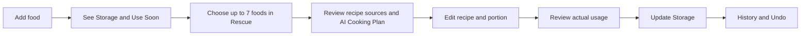
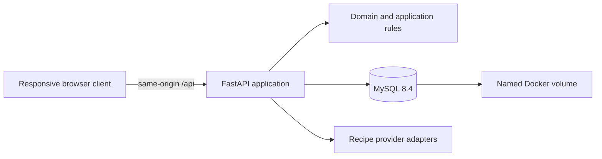

# Fridge Pal

**Turn food that is about to expire into tonight's meal.**

Fridge Pal is a private, self-hosted digital twin for household food storage. A home cook records what is in the fridge, freezer, and pantry; Fridge Pal surfaces expiration risk at a glance, turns urgent ingredients into grounded meal ideas, lets them edit and portion recipes, and reconciles what was actually used back into inventory — atomically and reversibly.

The product personality is cheerful and calm: a coral refrigerator mascot, a warm cream canvas, and a glanceable tile interface that works identically on mobile and desktop, in English and Simplified Chinese.

## The Golden Loop



- **Storage** — lot-level truth with aggregated overview tiles, urgency-colored by expiration window (Today → 1–2 days → 3–5 days → later), location filter (Fridge / Freezer / Pantry), and search.
- **Use Soon** — a derived alert rail of foods needing attention; urgent foods also remain in the complete inventory.
- **Rescue** — pick up to seven foods; each recipe source card shows a fixed seven-slot bright/dark belt of exactly which selected foods it uses, with separate `Open source` and `Use this recipe` actions. An AI Cooking Plan can synthesize a normalized recipe with ingredient quantities up front.
- **Recipe Editor** — one shared editor for AI plans, analyzed sources, and saved recipes; portion scaling preserves normalized base values and never mutates Storage while editing.
- **Reconciliation** — after cooking, `What did you use?` is the single mutation gate: one transactional, idempotent Storage update, recorded in History and reversible through compensating events.

## Feature Highlights

- **Multi-user with isolation** — username/password auth (JWT session cookie), every repository query scoped by `user_id`, cross-user access returns 404.
- **Bilingual by design** — full English and Simplified Chinese UI (vue-i18n), persisted locale preference, browser-language detection, and localized food names, dates, and numbers.
- **Responsive parity** — mobile and desktop expose the same feature set; mobile is the canonical interaction sequence, desktop gains width and a sidebar.
- **Brand system** — coral mascot identity on top of a two-layer semantic design-token system (color, spacing, radius, shadow, motion), shared primitives (`AppButton`, `AppInput`, `AppChip`, Food Tokens), and reduced-motion support.
- **Trustworthy inventory** — canonical unit conversion (g/ml/count), non-negative quantities, audit trail, undo.

## Tech Stack

| Layer | Technology |
|---|---|
| Frontend | Vue 3, TypeScript, Vite, vue-router, vue-i18n, plain CSS with semantic design tokens (no UI framework) |
| Backend | FastAPI, SQLAlchemy 2, Alembic, Pydantic v2, PyJWT, bcrypt |
| Database | MySQL 8.4 in Docker deployment; SQLite for local development |
| AI / recipes | Provider-neutral adapter layer; deterministic fixture provider by default, live provider behind `RECIPE_PROVIDER_MODE` |
| E2E | Playwright |
| Packaging | Single multi-stage Dockerfile (Vue build → non-root Python runtime) + Docker Compose |

## Architecture

The repository builds **one application image**: FastAPI serves both the JSON API and the compiled Vue client; MySQL is reachable only through the private Compose network.



### Backend — layered, domain-first

```text
backend/app/
├── api/               # FastAPI routers: auth, inventory, rescue, recipes, history, health
├── application/       # Use cases and transaction orchestration per feature
├── auth/              # JWT issuing/verification, password hashing, session cookies
├── domain/            # Pure rules: inventory lots, quantities, units, urgency, allocation
└── infrastructure/
    ├── db/            # SQLAlchemy models, sessions, demo seed
    ├── logging/       # Logging boundary
    └── recipe/        # Provider-neutral recipe adapters (fixture + live)
```

Design rules that hold everywhere:

- **Domain code is pure** — no HTTP, database, UI, or provider imports; quantity/urgency/allocation logic is unit-tested in isolation.
- **Server-owned mutations** — every inventory-changing operation is transactional, idempotent (idempotency keys), non-negative, and auditable; reversal happens through compensating events, never by deleting history.
- **AI is untrusted** — AI plans and retrieved web content may *propose* structured data but can never write inventory; the `Update storage` confirmation is the only mutation gate. No secret or raw retrieved page content reaches client code, URLs, analytics, or logs.
- **Per-user isolation** — auth is a JWT session cookie (bcrypt password hashing); every query filters by `user_id`.
- **Alembic owns the schema** — the application container applies migrations at startup.

### Frontend — feature stores + token-driven styling

```text
frontend/src/
├── api/               # Typed HTTP clients per feature
├── components/        # Shared primitives (AppButton, AppInput, AppChip, nav, headers)
│   ├── food-token/    # Deterministic semi-flat food icon system
│   ├── recipes/  rescue/  storage-tile/
├── composables/       # Cross-cutting state (useLocale)
├── features/          # auth, storage, rescue, recipes — composable stores (no Pinia)
├── i18n/              # en + zh-CN message trees
├── styles/            # tokens.css (raw palette → semantic aliases) + base.css
└── views/             # Route-level views (Storage, Rescue, Recipe Editor, History, auth…)
```

- **Two-layer tokens** — components only consume semantic aliases (`--color-ink`, `--color-brand`, urgency and location ramps with WCAG-verified text pairs), never raw palette values; a future dark theme can re-point the alias layer.
- **Brand vs. interaction color discipline** — coral is the brand color (mascot, auth screens, empty states, sidebar); blue remains the action color; the expiration urgency ramp stays semantically reserved.
- **Mobile-first responsive** — bottom tab bar on mobile becomes a sidebar with a brand block at ≥880px; tap targets ≥44px; `100dvh` containers; safe-area insets.

## Repository Layout

```text
├── backend/           # FastAPI app, Alembic migrations, pytest suite (unit/integration/contract/security)
├── frontend/          # Vue 3 client
├── e2e/               # Playwright checks and capture scripts
├── docs/
│   ├── PRODUCT_REQUIREMENTS.md      # Product scope and acceptance criteria
│   ├── DOMAIN_AND_AI_CONTRACTS.md   # Domain, mutation, and AI-safety contracts
│   ├── UX_SPEC.md                   # Interaction and visual specification
│   ├── IMPLEMENTATION_PLAN.md       # Ordered delivery slices
│   ├── DEPLOYMENT.md                # Canonical server operations runbook
│   ├── plans/                       # Approved feature designs (dated)
│   └── visuals/                     # Non-production style reference boards
├── compose.yaml       # App + MySQL + healthchecks + persistent volume
├── Dockerfile         # Vue build → non-root Python runtime
└── AGENTS.md          # Mandatory repository instructions for agents
```

## Getting Started

### Local development

Backend (Python 3.11+):

```bash
cd backend
python3 -m venv .venv
source .venv/bin/activate
pip install -e '.[dev]'
alembic upgrade head
uvicorn app.main:app --reload --port 8000
```

Frontend (Node.js 22+):

```bash
cd frontend
npm ci
npm run dev
```

Vite serves `http://127.0.0.1:5173` and proxies `/api` to port `8000`. Local development uses SQLite and seeds a demo account (password from `FRIDGE_PAL_DEMO_PASSWORD` in `.env`). The API health endpoint is `http://127.0.0.1:8000/api/health`.

### Docker deployment

For a server, follow the canonical runbook [docs/DEPLOYMENT.md](docs/DEPLOYMENT.md) (firewall, health checks, upgrades, backups, rollbacks). Minimal first start:

```bash
cp .env.example .env
chmod 600 .env
# Set FRIDGE_PAL_JWT_SECRET, FRIDGE_PAL_DEMO_PASSWORD, and MYSQL_PASSWORD.
docker compose config --quiet
docker compose build --pull app
docker compose up -d
```

The safe default binds to `127.0.0.1:8080`. For public deployment, set `FRIDGE_PAL_JWT_SECRET` (≥32 chars), `FRIDGE_PAL_DEMO_PASSWORD`, and `FRIDGE_PAL_COOKIE_SECURE=true` behind HTTPS.

## Verification

```bash
# Backend
cd backend
.venv/bin/pytest -q                 # unit, integration, contract, security
.venv/bin/ruff check app tests
.venv/bin/mypy app

# Frontend
cd frontend
npm run lint
npm run typecheck
npm run build

# Deployment configuration
docker compose --env-file .env.example config --quiet
docker compose --env-file .env.example build app
```

## Environment Summary

Full reference in [docs/DEPLOYMENT.md](docs/DEPLOYMENT.md). Key variables:

| Variable | Default | Purpose |
|---|---|---|
| `APP_BIND_ADDRESS` | `127.0.0.1` | Host interface exposed by Compose |
| `APP_PORT` | `8080` | Host HTTP port |
| `MYSQL_DATABASE` | `fridgital` | Production database name |
| `RECIPE_PROVIDER_MODE` | `fixture` | Deterministic or live recipe provider mode |
| `APP_TIMEZONE` | `Asia/Shanghai` | Calendar and urgency timezone |
| `SEED_DEMO_DATA` | `true` | Seed deterministic demo inventory |
| `FRIDGE_PAL_JWT_SECRET` | (required) | JWT signing secret, ≥32 chars |
| `FRIDGE_PAL_DEMO_PASSWORD` | (required) | Built-in demo account password |
| `FRIDGE_PAL_COOKIE_SECURE` | `false` | Secure cookie flag for HTTPS |

Secrets live only in the untracked `.env`; they must never enter the frontend bundle or Git history.

## Documentation and Authority

Read in this order before changing application code:

1. [Product Requirements](docs/PRODUCT_REQUIREMENTS.md)
2. [Domain and AI Contracts](docs/DOMAIN_AND_AI_CONTRACTS.md)
3. [UX Specification](docs/UX_SPEC.md)
4. [Implementation Plan](docs/IMPLEMENTATION_PLAN.md)
5. [AGENTS.md](AGENTS.md)

When details conflict: `Product Requirements > Domain and AI Contracts > UX Specification > visual boards`.

## MVP Non-Goals

- Photo recognition, barcode scanning, or receipt import
- Notifications, shopping lists, nutrition tracking, or long-term meal planning
- Custom storage locations beyond Fridge, Freezer, and Pantry
- An autonomous AI agent that mutates inventory without explicit confirmation
