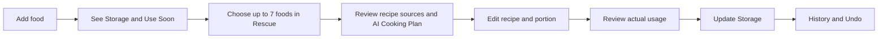
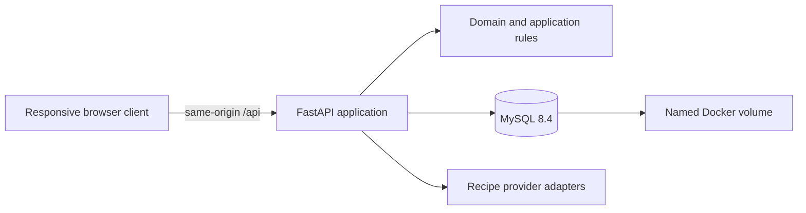

# Fridge Pal

Fridge Pal is a private, self-hosted digital twin for household food storage. It helps one home cook record food, notice expiration risk, turn urgent ingredients into meal ideas, edit recipes, and reconcile actual usage back into Storage.

**Primary promise:** Turn food that is about to expire into tonight's meal.

> **Security boundary:** Fridge Pal has no authentication. Deploy it on a private network, through a VPN, or behind a firewall that permits only trusted source IPs. Unrestricted public exposure is unsupported.

## Current Status

Fridge Pal is an actively developed hackathon MVP.

- Storage, Use Soon, Add Food, item editing, canonical unit conversion, Rescue selection, recipe results, Recipe Editor, Saved Recipes UI, and cooking reconciliation interactions are implemented.
- Inventory data is persisted through FastAPI, SQLAlchemy, Alembic, and MySQL in Docker deployments.
- Recipe discovery currently retains deterministic fixture behavior; live provider integration remains adapter-controlled and optional.
- History is still represented by a placeholder route, and parts of the recipe/saved-recipe flow remain client-side MVP state rather than complete server persistence.
- Docker Compose is the supported production deployment path.

Do not treat the current MVP as a public multi-user service.

## Deploy with Docker Compose

For a new self-managed Linux server, follow the canonical [Docker Compose deployment runbook](docs/DEPLOYMENT.md). It includes IP-based access, firewall requirements, health checks, upgrades, backups, restores, rollbacks, and troubleshooting.

Minimal first start:

```bash
cp .env.example .env
chmod 600 .env
# Replace MYSQL_PASSWORD and review APP_BIND_ADDRESS before continuing.
docker compose config --quiet
docker compose build --pull app
docker compose up -d
docker compose ps
```

The safe default binds to `127.0.0.1:8080`. For direct access through a server IP, set `APP_BIND_ADDRESS=0.0.0.0` and allow port `8080` only from trusted source addresses in the host or cloud firewall.

## Product Loop



## Architecture

The repository builds one application image. FastAPI serves both the API and the compiled Vue client; MySQL is reachable only through the private Compose network.



Inventory mutations remain server-owned, transactional, idempotent, non-negative, auditable, and reversible through compensating events. AI and retrieved web content are untrusted and cannot write inventory.

## Repository Structure

```text
fridge-pal/
├── backend/
│   ├── app/
│   │   ├── api/                 # FastAPI routes and transport models
│   │   ├── application/         # Use cases and transaction orchestration
│   │   ├── domain/              # Pure inventory, quantity, and urgency rules
│   │   └── infrastructure/
│   │       ├── db/              # SQLAlchemy models, sessions, and seed handling
│   │       ├── logging/         # Logging boundary
│   │       └── recipe/          # Provider-neutral recipe adapters
│   ├── alembic/                 # Database migrations
│   ├── tests/                   # Unit, integration, contract, and security tests
│   └── pyproject.toml
├── frontend/
│   ├── src/
│   │   ├── api/                 # Typed HTTP clients
│   │   ├── components/          # Shared headers, icons, food tokens, and controls
│   │   ├── features/            # Storage, Rescue, and Recipes state
│   │   ├── i18n/                # English and Simplified Chinese resources
│   │   ├── styles/              # Semantic visual tokens and global styles
│   │   └── views/               # Route-level Vue views
│   ├── package.json
│   └── vite.config.ts
├── docs/
│   ├── DEPLOYMENT.md            # Canonical server operations runbook
│   ├── PRODUCT_REQUIREMENTS.md  # Product scope and acceptance criteria
│   ├── DOMAIN_AND_AI_CONTRACTS.md
│   ├── UX_SPEC.md
│   ├── IMPLEMENTATION_PLAN.md
│   ├── plans/                   # Approved feature designs and execution plans
│   └── visuals/                 # Non-production visual references
├── e2e/                         # Optional browser checks and manual scripts
├── .dockerignore                # Reproducible, minimal image build context
├── .env.example                 # Non-secret deployment configuration template
├── compose.yaml                 # App, MySQL, health, and persistent volume
├── Dockerfile                   # Vue build plus non-root Python runtime
└── AGENTS.md                    # Mandatory repository instructions for agents
```

### Runtime ownership

- The browser owns presentation and temporary interaction state only.
- FastAPI owns validation, inventory operations, persistence access, and provider credentials.
- Domain code stays independent from HTTP, UI, database, and provider packages.
- Alembic owns schema evolution; the application container applies migrations at startup.
- MySQL is the production source of truth and lives in the `fridgital-mysql-data` volume.

## Canonical Documentation

Read these documents completely and in this order before changing application code:

1. [Product Requirements](docs/PRODUCT_REQUIREMENTS.md)
2. [Domain and AI Contracts](docs/DOMAIN_AND_AI_CONTRACTS.md)
3. [UX Specification](docs/UX_SPEC.md)
4. [Implementation Plan](docs/IMPLEMENTATION_PLAN.md)
5. [AGENTS.md](AGENTS.md)

When details conflict, authority is:

```text
Product Requirements > Domain and AI Contracts > UX Specification > visual boards
```

## Local Development

### Backend

Requires Python 3.11 or newer.

```bash
cd backend
python3 -m venv .venv
source .venv/bin/activate
pip install -e '.[dev]'
alembic upgrade head
uvicorn app.main:app --reload --port 8000
```

The local default database is SQLite. The API health endpoint is `http://127.0.0.1:8000/api/health`.

### Frontend

Requires Node.js 22 or newer.

```bash
cd frontend
npm ci
npm run dev
```

Vite serves `http://127.0.0.1:5173` and proxies `/api` to the local backend on port `8000`.

## Verification

Backend:

```bash
cd backend
.venv/bin/pytest -q
.venv/bin/ruff check app tests
.venv/bin/mypy app
```

Frontend:

```bash
cd frontend
npm run lint
npm run typecheck
npm run build
```

Deployment configuration and image:

```bash
docker compose --env-file .env.example config --quiet
docker compose --env-file .env.example build app
```

Browser automation is not required for routine documentation or container changes. Add focused end-to-end coverage only when a changed user journey needs it.

## Environment Summary

The complete variable reference and operational guidance live in [docs/DEPLOYMENT.md](docs/DEPLOYMENT.md). Important defaults are:

| Variable | Default | Purpose |
|---|---|---|
| `APP_BIND_ADDRESS` | `127.0.0.1` | Host interface exposed by Compose. |
| `APP_PORT` | `8080` | Host HTTP port. |
| `MYSQL_DATABASE` | `fridgital` | Production database name. |
| `RECIPE_PROVIDER_MODE` | `fixture` | Deterministic or live recipe provider mode. |
| `APP_TIMEZONE` | `Asia/Shanghai` | Calendar and urgency timezone. |
| `APP_DEFAULT_LOCALE` | `en` | Initial interface locale. |
| `SEED_DEMO_DATA` | `true` | Whether deterministic MVP inventory is seeded. |

Secrets belong only in the untracked `.env` file or a future approved secret manager. They must never enter the frontend bundle or Git history.

## MVP Non-Goals

- Public accounts, authentication, or multi-user household collaboration.
- Unrestricted public internet deployment.
- Photo recognition, barcode scanning, or receipt import.
- Notifications, shopping lists, nutrition tracking, or long-term meal planning.
- Custom storage locations beyond Fridge, Freezer, and Pantry.
- An autonomous AI agent that mutates inventory without explicit confirmation.
