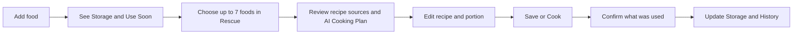

# Fridgital

Fridgital is a private, self-hosted digital twin for household food storage. It helps a solo home cook capture food with minimal effort, notice expiration risk, discover source-grounded recipes, adjust a recipe, cook, and reconcile actual usage back into inventory.

**Primary promise:** Turn food that is about to expire into tonight's meal.

**Current status:** Product and interaction design are consolidated. Application implementation has not started.

## Start Here

Read the canonical documents in this order:

1. [Product Requirements](docs/PRODUCT_REQUIREMENTS.md) — scope, requirements, journeys, acceptance criteria, and open decisions.
2. [Domain and AI Contracts](docs/DOMAIN_AND_AI_CONTRACTS.md) — entities, invariants, operations, AI grounding, transactions, security, and errors.
3. [UX Specification](docs/UX_SPEC.md) — navigation, screen behavior, responsive rules, visual language, states, accessibility, and reference boards.
4. [Implementation Plan](docs/IMPLEMENTATION_PLAN.md) — delivery slices, test gates, hackathon cut line, and deployment readiness.
5. [AGENTS.md](AGENTS.md) — mandatory instructions for coding agents working in this repository.

If documents conflict, use the order above. Prototype pixels illustrate the intended experience but never override written behavior.

## Product Loop



## MVP Snapshot

- Solo-user private application deployed with Docker Compose.
- Responsive web UI with feature parity across mobile and desktop; mobile web is the canonical daily-use composition.
- Seeded and user-extensible food library with natural units and storage-aware shelf-life defaults.
- Lot-level inventory in Fridge, Freezer, and Pantry, shown as compact aggregated food tiles.
- Five-level expiration urgency and a complete Use Soon section.
- Persistent seven-slot Rescue selection and recent-search restoration.
- Source-grounded recipe discovery with visible provenance.
- One canonical Recipe Editor for AI plans, analyzed sources, and saved recipes.
- Portion scaling, Storage-linked ingredient addition, saved Recipes, editable cooking deductions, History, and Undo.
- English and Simplified Chinese localization architecture.

## Current Visual References

- [Storage and Rescue](docs/visuals/storage-and-rescue.png)
- [Recipe Discovery and Editor](docs/visuals/recipe-discovery-and-editor.png)
- [Recipes and Cooking](docs/visuals/recipes-and-cooking.png)

These boards are mobile-first reference states. They do not imply that exact generated icons, fonts, spacing, or tiny bitmap copy are production assets.

## Explicit Non-Goals for the Hackathon MVP

- Public accounts or multi-user household collaboration.
- Photo recognition, barcode scanning, or receipt import.
- Notifications, shopping lists, nutrition tracking, or long-term meal planning.
- Custom storage locations beyond Fridge, Freezer, and Pantry.
- A chat-first interface or an autonomous agent that mutates inventory without confirmation.

## Development

> **Warning:** Fridgital has no authentication. Run it on a private network or loopback only.

Backend (Python 3.11+):

```bash
cd backend
python3 -m venv .venv
source .venv/bin/activate
pip install -e '.[dev]'
pytest tests                 # boot smoke test
ruff check . && ruff format --check . && mypy app
uvicorn app.main:app --reload   # serves http://localhost:8000/api/health
```

Frontend (Node 22+):

```bash
cd frontend
npm install
npm run dev        # http://localhost:5173, proxies /api to localhost:8000
npm run typecheck && npm run lint && npm run build
```

End-to-end tests (Playwright, browsers not installed by default):

```bash
cd e2e
npm install
npx playwright install   # one-time browser download
npm test
```

Docker deployment:

```bash
cp .env.example .env   # set MYSQL_USER / MYSQL_PASSWORD
docker compose up --build   # app on http://localhost:8080
```

## Decisions Required Before Scaffolding

- `OQ-01`: application framework, database library, and test stack.
- `OQ-02`: recipe retrieval provider and recipe-structuring model/provider.
- `OQ-03`: default deployment exposure: loopback/LAN only or reverse-proxy-protected external access.

The implementation plan supplies a minimal recommended default if the user delegates these choices, but a coding agent must not silently install tools or select external services.
