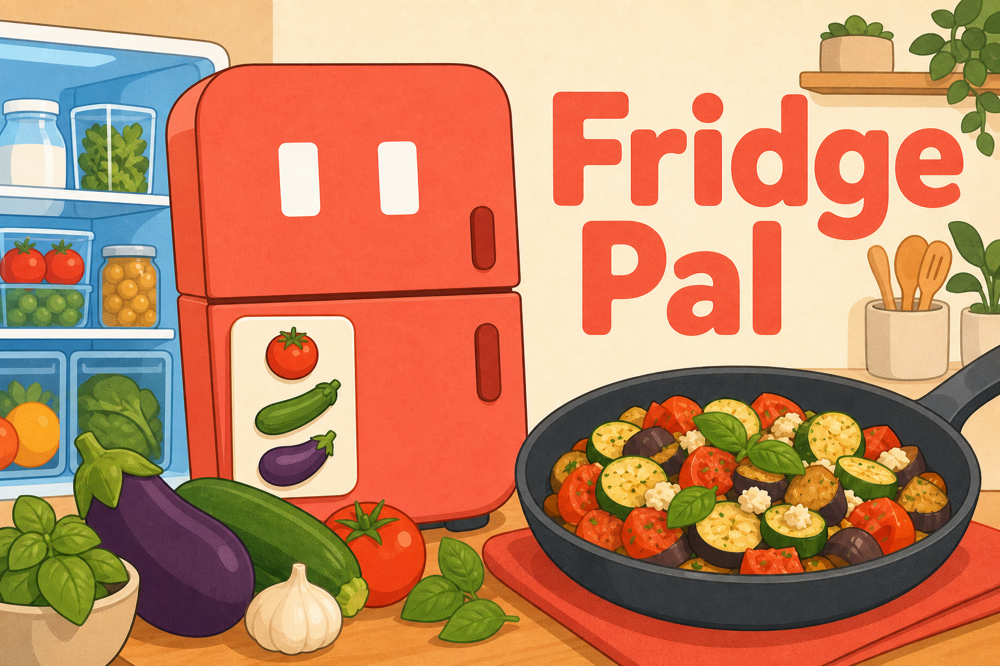
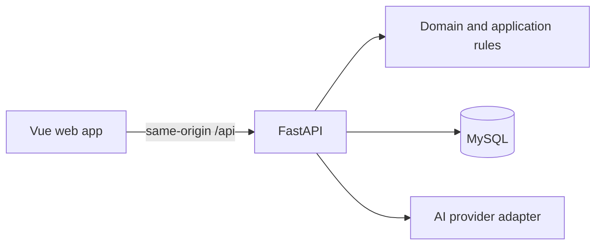

# Fridge Pal

> Keep track of what is in your fridge, spot what needs using soon, and turn it into a meal with AI.



**Trying the project? Start with the [five-minute User Guide](USER_GUIDE.md).**

Fridge Pal is a friendly food tracker and AI cooking companion for people who do not want good ingredients to disappear into the back of the fridge.

It keeps a clear record of food across the fridge, freezer, and pantry, brings soon-to-expire ingredients to the front, and suggests practical meals that help use them up.

## Why I built it

I live alone and enjoy cooking, so I often buy different ingredients and keep them in my fridge. The problem is that I forget what I already have and which food is about to expire.

When several ingredients need to be used soon, I want a quick way to turn them into one meal instead of letting them go to waste. I built Fridge Pal as an app for my own daily life.

## What it does

- **Track food clearly.** Add food with its quantity, location, stored date, and expiration date.
- **See what needs attention.** The `Use Soon` view highlights food that should be used first without hiding it from the full inventory.
- **Rescue ingredients with AI.** Select up to seven foods and generate a meal idea around what is already available.
- **Adjust the recipe.** Review ingredients, change portions, and edit the recipe before cooking.
- **Keep Storage honest.** Confirm what was actually used before any inventory quantity changes.
- **Use it anywhere.** The same workflow works on mobile and desktop in English and Simplified Chinese.

## The main flow


## Built with Codex & GPT-5.6

Fridge Pal was built during a fast, iterative hackathon process with **Codex powered by GPT-5.6** as my design and engineering collaborator.

I started with a personal problem and made the final product decisions. Codex and GPT-5.6 helped me turn those decisions into a working application by supporting:

- **Product exploration:** brainstorming the core idea, identifying the smallest useful workflow, and turning rough thoughts into clear requirements.
- **UX iteration:** reviewing each screen and interaction, finding confusing steps, and simplifying an early version that showed too much data.
- **Full-stack implementation:** building and refining the Vue frontend, FastAPI backend, database models, API contracts, authentication, and responsive layouts.
- **AI boundaries:** separating recipe suggestions from trusted inventory changes so generated content can never update Storage by itself.
- **Testing and debugging:** writing behavior tests, checking mobile and desktop flows, investigating failures, and validating Docker deployment.
- **Communication and polish:** improving interface copy, bilingual content, documentation, the project pitch, and visual assets.

The most useful part of working with Codex was the speed of iteration. I could describe what felt wrong in a flow, inspect a concrete implementation, test it, and refine it again. GPT-5.6 helped across product thinking, design, code, and debugging, while I remained responsible for the product direction and final review.

## How the AI is used

AI has a focused role inside Fridge Pal. It receives the ingredients selected by the user and proposes a structured meal idea. The user can review and edit the result before cooking.

AI output is treated as a suggestion, not trusted inventory data. It cannot add, remove, or consume food. `Update storage` is a separate confirmation step owned by the user.

I originally explored searching published recipes with Tavily and asking AI to extract structured recipe data. Recipe pages were inconsistent and noisy, reliable extraction was difficult, and reusing published content introduced attribution and copyright concerns. For the hackathon, I chose a simpler approach: generate original meal ideas directly from the selected ingredients.

## Tech stack

| Area | Technology |
| --- | --- |
| Frontend | Vue 3, TypeScript, Vite, Vue Router |
| Styling | Plain CSS, semantic design tokens, responsive layouts |
| Localization | vue-i18n, English and Simplified Chinese |
| Backend | FastAPI, Python, Pydantic |
| Data | SQLAlchemy 2, Alembic, MySQL 8.4, SQLite for local development |
| Authentication | JWT session cookies, bcrypt |
| AI | Provider-neutral OpenAI-compatible adapter |
| Testing | pytest, Playwright, Ruff, mypy |
| Deployment | Docker, Docker Compose |
| Build collaborator | Codex powered by GPT-5.6 |

## Architecture

Fridge Pal is packaged as one application image. FastAPI serves both the JSON API and the compiled Vue client, while MySQL runs inside the private Docker Compose network.



The codebase keeps a few important boundaries:

- Domain rules do not depend on the UI, database, or AI provider.
- Every repository query is scoped by `user_id`.
- Inventory quantities cannot become negative.
- Inventory-changing operations are transactional and idempotent.
- AI credentials and provider calls remain on the server.
- Editing or generating a recipe never changes Storage.

## Project structure

```text
Frigital/
├── frontend/               # Vue 3 client
├── backend/                # FastAPI application and tests
├── e2e/                    # Playwright flows and screenshots
├── docs/                   # Requirements, UX, contracts, and plans
├── compose.yaml            # App and MySQL services
└── Dockerfile              # Multi-stage production image
```

## Run locally

### Backend

```bash
cd backend
python3 -m venv .venv
source .venv/bin/activate
pip install -e '.[dev]'
alembic upgrade head
uvicorn app.main:app --reload --port 8000
```

### Frontend

```bash
cd frontend
npm ci
npm run dev
```

The Vite development server runs at `http://127.0.0.1:5173` and proxies `/api` to FastAPI on port `8000`.

## Run with Docker

Create the local environment file and set the required secrets:

```bash
cp .env.example .env
chmod 600 .env
```

At minimum, configure:

- `FRIDGE_PAL_JWT_SECRET`
- `FRIDGE_PAL_DEMO_PASSWORD`
- `MYSQL_PASSWORD`

Then build and start the app:

```bash
docker compose config --quiet
docker compose build app
docker compose up -d
```

The safe default binds the application to `127.0.0.1:8080`. See [`docs/DEPLOYMENT.md`](docs/DEPLOYMENT.md) for production setup, backups, upgrades, and HTTPS guidance.

## Verification

```bash
# Backend
cd backend
.venv/bin/pytest -q
.venv/bin/ruff check app tests
.venv/bin/mypy app

# Frontend
cd frontend
npm run lint
npm run typecheck
npm run build

# Deployment configuration
docker compose --env-file .env.example config --quiet
```

## What I learned

Building Fridge Pal taught me how much work sits between an idea and a product that feels simple. My first interaction flow had too many steps and showed so much data that even I got lost. Removing unnecessary actions and deciding what information mattered on each screen made the app much easier to use.

I also learned where AI works well and where it struggles. AI was useful for turning a clear set of ingredients into a meal idea, but extracting reliable structured data from arbitrary recipe websites was much less predictable. It also reinforced an important rule for the product: AI may suggest, but the user must stay in control of real inventory changes.

## What is next

The next priorities are improving performance and polish, making generated recipes more accurate and practical, and clarifying the difference between editing a recipe and cooking it to update Storage.

I also want to explore a dedicated seasonings section and community features such as sharing recipes. Most importantly, I plan to keep using Fridge Pal in my own kitchen and improve it through real everyday cooking.

## Documentation

- [User Guide](USER_GUIDE.md)
- [Product Requirements](docs/PRODUCT_REQUIREMENTS.md)
- [Domain and AI Contracts](docs/DOMAIN_AND_AI_CONTRACTS.md)
- [UX Specification](docs/UX_SPEC.md)
- [Implementation Plan](docs/IMPLEMENTATION_PLAN.md)
- [Deployment Guide](docs/DEPLOYMENT.md)

---

Built for fewer forgotten ingredients and more home-cooked meals.
