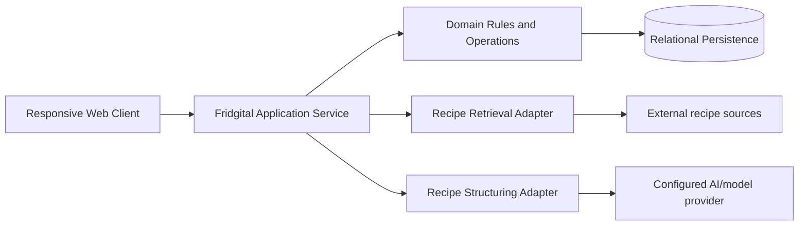
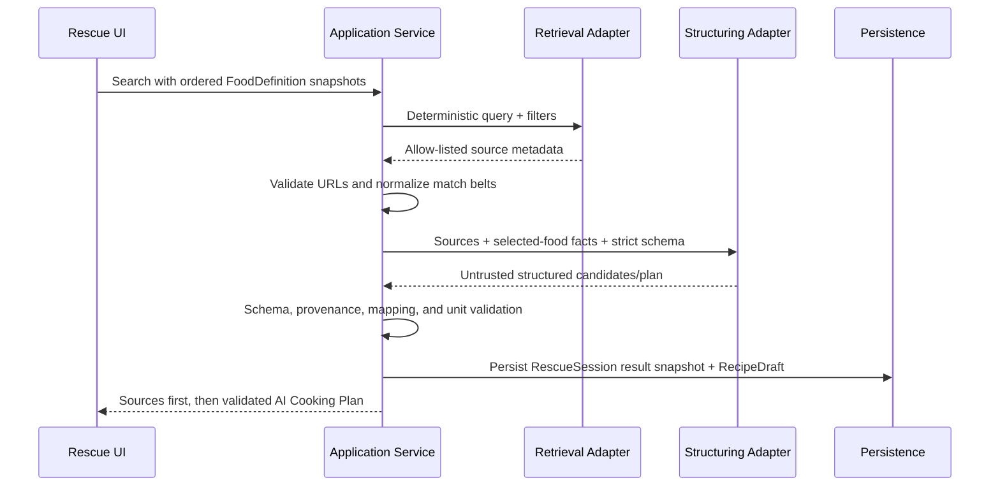

# Fridgital Domain and AI Contracts

**Status:** Canonical technical-behavior specification  
**Scope:** Stack-neutral domain, persistence, provider, mutation, security, and error contracts  
**Authority:** Product behavior in this document overrides implementation convenience

## 1. System Boundary

Fridgital may be implemented as one deployable application, but it must preserve these logical boundaries:



- The browser communicates only with the Fridgital application service.
- The application service owns validation, shelf-life rules, unit conversion, search orchestration, mapping, transaction boundaries, and persistence.
- Provider credentials never reach the browser.
- Retrieval and structuring are separate versioned interfaces even when one vendor implements both.
- Provider output and retrieved content are untrusted input.
- No AI/provider operation can write inventory directly.

## 2. Canonical Types and Enums

| Type | Values or contract |
|---|---|
| `StorageLocation` | `FRIDGE | FREEZER | PANTRY` |
| `InventoryLotStatus` | `ACTIVE | DEPLETED | DISCARDED` |
| `ExpirySource` | `LIBRARY_DEFAULT | USER_OVERRIDE | NONE` |
| `FoodOrigin` | `SEEDED | USER_CREATED` |
| `RescueSessionStatus` | `DRAFT | SEARCHING | SEARCHED | PLAN_READY | COOKED | ARCHIVED` |
| `RecipeOriginType` | `AI_PLAN | WEB_SOURCE | SAVED_RECIPE | PERSONAL` |
| `RecipeAnalysisStatus` | `NOT_REQUIRED | PENDING | PARTIAL | READY | FAILED` |
| `IngredientAmountKind` | `NUMERIC | QUALITATIVE | UNKNOWN` |
| `IngredientMappingStatus` | `EXACT | ALIAS | SUGGESTED | UNRESOLVED` |
| `CookingSessionStatus` | `DRAFT | REVIEW | COMMITTED | CANCELLED` |
| `InventoryReason` | `CHECK_IN | EDIT | MANUAL_CONSUMPTION | COOKING | DISCARD | MOVE | REVERSAL` |
| Date | Local calendar date without time. |
| Timestamp | UTC instant. |
| Quantity | Non-negative decimal in a canonical base unit. |

Do not use floating-point arithmetic for persisted quantities or money-like decimal calculations.

## 3. Domain Entities

### `DE-01` — FoodDefinition

| Field | Contract |
|---|---|
| `id` | Stable identifier. |
| `names` | Localized name map with at least the initial primary locale. |
| `aliases` | Localized normalized search aliases. |
| `category` | Stable category key. |
| `visual_key` | Curated Food Token key or deterministic fallback key. |
| `base_unit` | Natural canonical unit such as `g`, `ml`, or `piece`. |
| `rounding_increment` | Smallest sensible UI/storage increment in base unit. |
| `package_presets` | Optional labeled amounts converted into base unit. |
| `recommended_storage` | One StorageLocation. |
| `origin` | Seeded or user-created. |
| `active` | Soft availability flag; referenced historical records remain valid. |

### `DE-02` — ShelfLifeRule

| Field | Contract |
|---|---|
| `food_definition_id` | FoodDefinition reference. |
| `storage_location` | One StorageLocation. |
| `duration_days` | Non-negative integer calendar days. |
| `source_note` | Optional internal provenance; never a food-safety guarantee. |

The pair `(food_definition_id, storage_location)` is unique. Missing rules are valid and produce no suggested expiration.

### `DE-03` — InventoryLot

| Field | Contract |
|---|---|
| `id` | Stable identifier. |
| `food_definition_id` | Canonical food reference. |
| `quantity` | Non-negative decimal in FoodDefinition.base_unit. |
| `storage_location` | Fridge, Freezer, or Pantry. |
| `stored_on` | User-observable local calendar date; defaults to today. |
| `expires_on` | Nullable local calendar date. |
| `expiry_source` | Library default, user override, or none. |
| `status` | Active, depleted, or discarded. |
| `created_at`, `updated_at` | UTC audit timestamps. |

Multiple active lots of the same food and location are allowed. Urgency is derived and is not a lifecycle status.

### `DE-04` — RescueSession

| Field | Contract |
|---|---|
| `id` | Stable identifier. |
| `status` | RescueSessionStatus. |
| `selected_foods` | Ordered list of one to seven inventory/food references plus immutable display snapshots. |
| `intent` | Optional structured filters or user intent. |
| `source_results` | Versioned normalized result snapshot. |
| `ai_plan_draft_id` | Nullable RecipeDraft reference. |
| `last_view` | Restoration route/subview. |
| `created_at`, `updated_at`, `searched_at` | UTC timestamps. |

Drafts may change in place. Starting search freezes the selected display snapshots and intent. Editing a searched session creates a new draft copy. Current Storage changes never rewrite historical results.

### `DE-05` — RecipeSourceResult

| Field | Contract |
|---|---|
| `id` | Stable within a RescueSession snapshot. |
| `url` | Verified `http` or `https` URL from the retrieval allow-list. |
| `title`, `publisher`, `domain` | Sanitized source metadata. |
| `retrieved_at` | UTC timestamp. |
| `duration`, `base_yield` | Nullable; display only when verified. |
| `selected_food_usage` | One boolean/mapping entry for every ordered Rescue slot. |
| `provider_metadata` | Minimal non-secret diagnostics; not a provider response dump. |

### `DE-06` — RecipeDraft

| Field | Contract |
|---|---|
| `id` | Stable identifier. |
| `origin_type` | AI plan, web source, saved recipe, or personal. |
| `rescue_session_id` | Nullable RescueSession reference. |
| `saved_recipe_id` | Nullable SavedRecipe reference when editing an existing recipe. |
| `source_references` | Ordered normalized provenance records. |
| `name` | Editable; required to save. |
| `description` | Editable, optional. |
| `base_yield` | Structured amount and label, such as `2 servings`. |
| `portion_multiplier` | Positive decimal; `0.5` is the solo-cook quick default for retrieved/AI recipes. |
| `ingredients` | Ordered RecipeIngredient list. |
| `instructions` | Ordered structured steps. |
| `analysis_status` | RecipeAnalysisStatus. |
| `draft_updated_at` | UTC autosave timestamp. |

### `DE-07` — RecipeIngredient

| Field | Contract |
|---|---|
| `id` | Stable within recipe lineage. |
| `display_name` | Localized or source-derived sanitized name. |
| `food_definition_id` | Nullable canonical mapping. |
| `storage_food_reference` | Nullable explicit Storage linkage. |
| `amount_kind` | Numeric, qualitative, or unknown. |
| `base_amount` | Nullable decimal for numeric ingredients. |
| `unit` | Nullable normalized unit. |
| `qualitative_amount` | Example: `to taste` or `as needed`. |
| `mapping_status` | Exact, alias, suggested, or unresolved. |
| `provenance` | Source field, AI inference, or user edit. |
| `needs_review` | Boolean derived from validation/provenance. |

`effective_amount = base_amount × portion_multiplier` for numeric ingredients. Qualitative amounts do not scale. Editing an effective amount back-normalizes the base amount using the active multiplier.

### `DE-08` — SavedRecipe

| Field | Contract |
|---|---|
| `id` | Stable identifier. |
| `name`, `description` | Curated editable identity. |
| `base_yield`, `ingredients`, `instructions` | Normalized base recipe truth. |
| `source_references` | Preserved provenance. |
| `origin_type` | Original recipe origin. |
| `last_portion_multiplier` | Nullable convenience preference. |
| `created_at`, `updated_at`, `last_cooked_at` | UTC timestamps. |

Current Storage availability is never persisted as SavedRecipe truth.

### `DE-09` — CookingSession

| Field | Contract |
|---|---|
| `id` | Stable identifier. |
| `saved_recipe_id` | Nullable for manual or transitional sessions. |
| `recipe_snapshot` | Immutable recipe/version snapshot used for this cook. |
| `portion_multiplier` | Positive decimal. |
| `proposed_usage` | Editable per-food demand before allocation. |
| `allocation_preview` | Lot-level proposed deltas plus Storage revision/version. |
| `status` | Draft, review, committed, or cancelled. |
| `idempotency_key` | Unique mutation key. |
| `created_at`, `committed_at` | UTC timestamps. |

### `DE-10` — InventoryTransaction

| Field | Contract |
|---|---|
| `id` | Stable identifier. |
| `inventory_lot_id` | Affected lot. |
| `quantity_delta` | Signed decimal in the FoodDefinition base unit. |
| `reason` | InventoryReason. |
| `cooking_session_id` | Nullable reference. |
| `activity_event_id` | User-readable event reference. |
| `idempotency_key` | Operation-level deduplication key. |
| `reversal_of` | Nullable original transaction reference. |
| `created_at` | UTC timestamp. |

Transactions are immutable. Corrections and Undo create compensating transactions.

### `DE-11` — ActivityEvent

Append-only user-readable event for check-in, edit, move, search, recipe save, manual consumption, cooking, discard, and reversal. It stores normalized display snapshots so History remains readable after later renaming or deletion.

## 4. Core Invariants

1. Inventory quantity is never negative.
2. Package labels are input conveniences; persisted quantities use canonical base units.
3. `stored_on` and `expires_on` are local dates; audit timestamps are UTC.
4. Expiration urgency is derived from the current local date and never implies food safety.
5. Storage overview sums active lots by food and active scope; lot identity remains available below overview.
6. History, source snapshots, cooking recipe snapshots, and transactions are immutable.
7. Undo uses compensating records.
8. Search selection contains at most seven ordered foods.
9. Recipe base amounts are independent of portion multiplier and current inventory.
10. AI/provider output cannot mutate Storage or bypass validation.
11. Inventory-changing operations are atomic and idempotent.
12. Provider outages cannot block core inventory operations.

## 5. Date and Urgency Rules

Suggested expiration:

```text
if a ShelfLifeRule exists:
  suggested_expires_on = stored_on + duration_days
  expiry_source = LIBRARY_DEFAULT
else:
  suggested_expires_on = null
  expiry_source = NONE
```

User selection of any other date sets `expiry_source = USER_OVERRIDE`.

Derived display urgency for an active lot:

| Condition | Level |
|---|---:|
| `expires_on < today` | 5 — Past date |
| `expires_on = today` | 4 — Today |
| `expires_on - today` is 1–2 days | 3 |
| `expires_on - today` is 3–5 days | 2 |
| Missing or more than 5 days | 1 — Later |

For an aggregated tile, display the most urgent active lot's state.

## 6. Units, Mapping, and Scaling

### 6.1 Ingredient mapping order

1. canonical FoodDefinition ID;
2. normalized exact name;
3. localized alias;
4. provider-suggested mapping validated against the library;
5. unresolved.

Persist the mapping status. Suggested and unresolved mappings remain editable and may block automatic deduction.

### 6.2 Conversion rules

- Convert mass-to-mass, volume-to-volume, and count-to-count deterministically.
- Count-to-mass or volume requires explicit FoodDefinition conversion metadata such as average piece weight or density.
- Never invent a cross-dimension conversion.
- Round effective values using the target unit's configured increment.
- Preserve enough internal precision that repeated portion changes do not accumulate display-rounding error.

## 7. Application Operations

The transport may be REST, RPC, server actions, or another approved mechanism. These operation contracts are stable.

| Operation | Required behavior |
|---|---|
| `searchFoodLibrary` | Locale-aware typeahead over names and aliases; returns defaults and visual key. |
| `createFoodDefinition` | Validates minimal custom-food identity and optional shelf-life rules. |
| `checkInFood` | Validates defaults/overrides and atomically creates InventoryLot plus ActivityEvent. |
| `getStorageOverview` | Returns Use Soon and scoped aggregates plus stable references to underlying lots. |
| `updateInventoryLot` | Applies validated edit/move/expiration change with History. |
| `previewManualReduction` | Computes lot allocation without mutation. |
| `commitManualReduction` | Revalidates and atomically creates transactions/event with idempotency. |
| `saveRescueDraft` | Autosaves ordered selection and intent. |
| `searchRecipeSources` | Freezes Rescue snapshot, retrieves/normalizes sources, and persists the result snapshot. |
| `generateCookingPlan` | Produces a validated RecipeDraft grounded in the retrieved source allow-list. |
| `analyzeRecipeSource` | Converts one selected allow-listed source into the same RecipeDraft schema. |
| `saveRecipeDraft` | Internal autosave; does not create SavedRecipe. |
| `publishSavedRecipe` | Validates required fields and creates/updates SavedRecipe. |
| `startCooking` | Auto-saves an unsaved draft, snapshots recipe/portion, and creates a non-mutating CookingSession. |
| `previewCookingUsage` | Maps user-edited demand to lot allocations and shortfalls. |
| `commitCookingUsage` | Revalidates preview revision and atomically commits transactions/session/event. |
| `undoActivity` | Creates linked compensating transactions and reversal event. |

## 8. Source-Grounded Recipe Pipeline



### 8.1 Retrieval input

- ordered selected FoodDefinition IDs and localized canonical names;
- available aggregate quantities and units;
- urgency states;
- optional user filters;
- locale;
- maximum candidate count and timeout.

Do not ask a model to infer actual inventory from prose.

### 8.2 Retrieval output

- allow-listed source URL;
- title, publisher/domain, retrieval timestamp;
- optional verified time/yield;
- evidence sufficient to compute selected-food usage;
- adapter diagnostics that contain no secret or raw page archive.

### 8.3 Versioned normalized recipe schema

Every structuring adapter returns a versioned object containing:

- schema version;
- title and optional description;
- base yield;
- normalized ingredients with original text, amount kind, amount, unit, mapping suggestion, provenance, and review flag;
- ordered steps;
- source references restricted to the retrieval allow-list;
- analysis status and warnings.

Reject unknown schema versions, missing required structure, non-allow-listed citations, invalid quantities, or unsafe URLs. At most one automatic repair attempt is permitted before visible failure.

### 8.4 Source result versus AI plan

- Recipe Source cards expose only verified normalized metadata and the fixed match belt.
- They do not synthesize `You'll also need …` text from arbitrary pages.
- The AI Cooking Plan may include its own complete ingredient list because it is a validated normalized recipe.
- `Use this recipe` launches source analysis; `Open source` never launches AI analysis.

### 8.5 Partial analysis

A partial RecipeDraft may open when it has a name plus at least one ingredient or instruction. Missing or uncertain fields show `Needs review`. Inference provenance is retained; inferred fields are not labeled source-verified.

## 9. Deduction Allocation and Atomic Commit

1. Start from user-confirmed per-food demand.
2. Allocate explicitly selected lots first when still valid.
3. Allocate remaining demand by earliest `expires_on`, then no-date lots last.
4. Never allocate more than lot availability.
5. Expose shortfall and cap proposal at available quantity.
6. Store the Storage revision/version used to build the preview.
7. At commit, revalidate revision, quantities, and mappings.
8. If stale, reject without mutation, recalculate, and require reconfirmation.
9. Otherwise write all InventoryTransactions, CookingSession state, lot statuses, and ActivityEvent in one database transaction.
10. Repeated submission with the same idempotency key returns the original committed result.

## 10. Error Contract

| Code | Condition | User experience | Data guarantee |
|---|---|---|---|
| `ERR-01` | Retrieval/provider timeout | Keep Rescue selection/results, show bounded Retry, allow Storage return. | No mutation. |
| `ERR-02` | Invalid structured output | One repair attempt, then visible failure. | Invalid recipe is not saved as valid truth. |
| `ERR-03` | No grounded sources | Explain no match; offer selection/filter change or Retry. | Never fabricate a source or grounded claim. |
| `ERR-04` | Source unavailable | Exclude before selection or mark unavailable while retaining historical provenance. | Existing snapshots remain readable. |
| `ERR-05` | Unknown mapping/incompatible unit | Mark unresolved and request explicit mapping/manual amount. | No guessed conversion/deduction. |
| `ERR-06` | Stale deduction preview | Identify/recalculate changed lines and require reconfirmation. | Stale commit rejected. |
| `ERR-07` | Database failure during commit | Keep review state and show Retry. | Complete rollback; no partial History. |
| `ERR-08` | Network interruption after submit | Preserve values and retry/poll with original idempotency key. | No duplicate mutation. |
| `ERR-09` | Invalid quantity/date/rule | Inline error near control. | Invalid data not persisted. |
| `ERR-10` | Fridgital server unreachable | Explicit disconnected state; preserve only current UI draft in memory. | No claimed offline persistence or hidden queue. |
| `ERR-11` | Recipe save failure | Retain RecipeDraft and show Retry. | No false Saved state. |

Every asynchronous surface defines loading, empty, partial, stale, disabled, error, and success behavior. Toasts are suitable for success/Undo, not blocking failures or field errors.

## 11. Security and Privacy

- The no-auth MVP is private-network software, not public-ready software.
- All external URLs use `http` or `https`, open with safe external-link attributes, and are sanitized before display.
- Source fetching rejects loopback, RFC1918/private, link-local, metadata-service, and otherwise prohibited destinations after every redirect and DNS resolution step.
- Enforce redirect, response-size, content-type, and timeout limits.
- Treat retrieved text as data, never as instructions. Separate system/developer prompts from retrieved content and defend against prompt injection.
- Never render retrieved HTML directly.
- Persist normalized fields and provenance, not raw page bodies.
- Validate and sanitize custom names and provider-derived text.
- Provider/database credentials come from deployment configuration and remain server-side.
- Logs use operation IDs, redact secrets, and exclude raw content.
- Persistent application data lives in a documented Docker volume. Provide manual backup and restore instructions.

## 12. Provider Configuration

Provider selection, model IDs, endpoint URLs, API keys, timeouts, retry limits, and retrieval services are deployment configuration, never domain constants.

Required adapter capabilities:

- versioned request/response schemas;
- deterministic fixture implementation for tests and offline demo development;
- timeout and cancellation;
- explicit error classification;
- URL allow-list enforcement;
- replaceability without UI/domain changes.

## 13. Verification Contract

| Layer | Required coverage |
|---|---|
| Unit | Shelf-life arithmetic, urgency boundaries, aggregation, decimal normalization, scaling/back-normalization, alias mapping, conversion, FEFO allocation, shortfalls, reversal math, idempotency. |
| Property/invariant | No negative quantities; allocation never exceeds demand/availability; commit plus reversal restores totals; date boundaries deterministic across time zones. |
| Adapter contract | Safe URLs, allow-list citations, schema versions, malformed output rejection, repair limit, timeout/cancel, provider replacement. |
| Integration | Check-in, lot edit/move, manual reduction, atomic cooking commit, rollback injection, stale conflict, duplicate submit, Undo. |
| End-to-end | Mobile and desktop journeys `UJ-01` through `UJ-06`, including provider-disabled inventory behavior. |
| Security | SSRF cases, unsafe redirect/DNS resolution, secret leakage scan, HTML sanitization, log redaction. |
| Deployment | Fresh Compose start, health, restart persistence, backup/restore, missing-provider configuration. |
