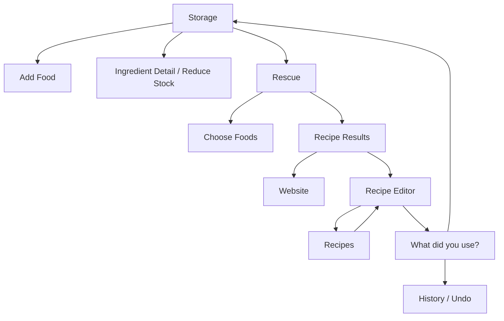
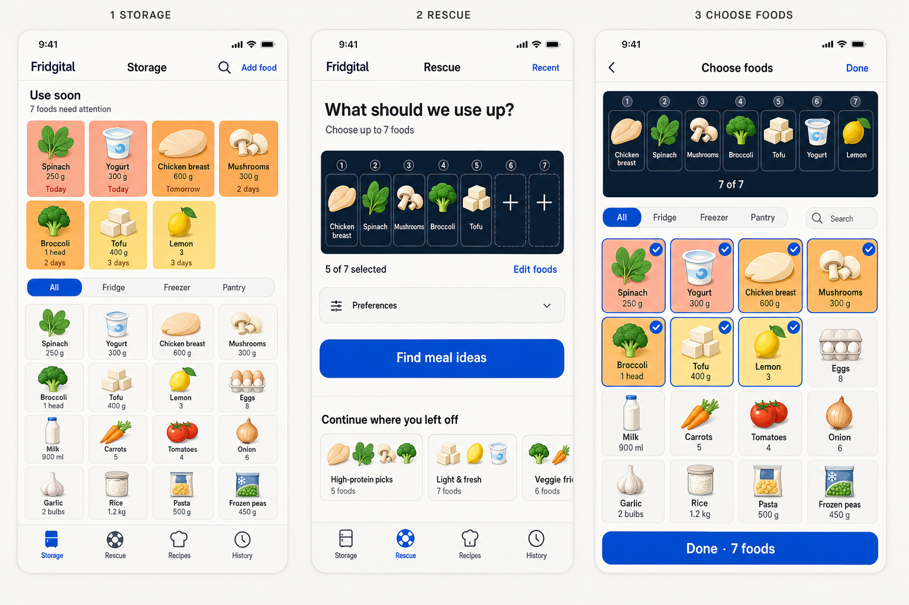
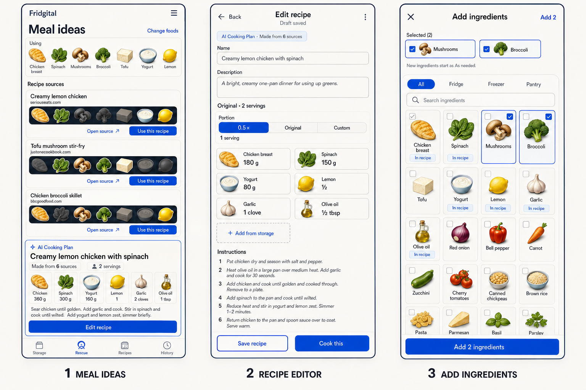
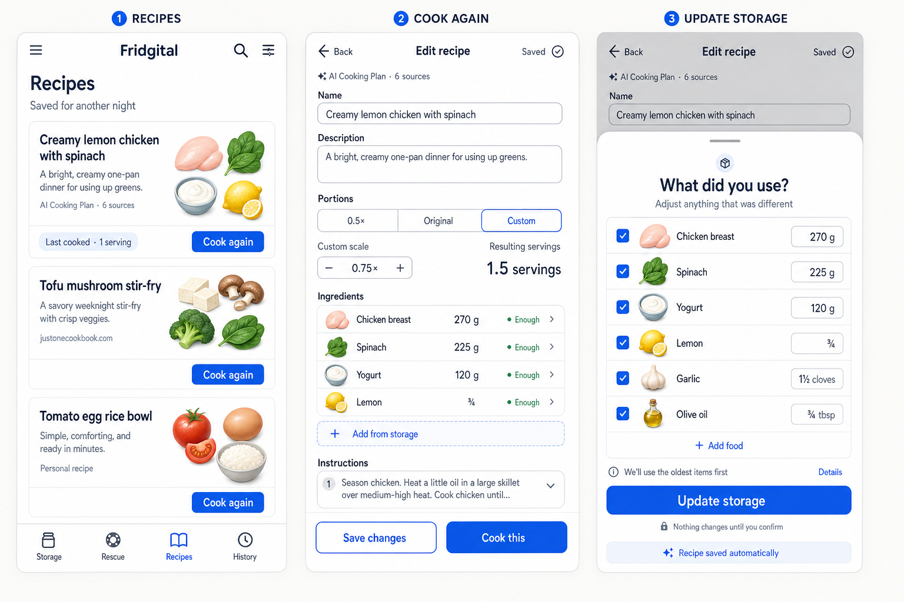

# Fridgital UX and Visual Specification

**Status:** Canonical implementation reference  
**Primary composition:** Mobile web around `390 × 844 CSS px`  
**Responsive contract:** Full feature parity across mobile and desktop  
**Visual references:** `docs/visuals/*.png`

## 1. Experience Principles

1. **Glanceable before exhaustive.** Quantity and urgency must be readable without opening every lot.
2. **Defaults before form filling.** Food Library defaults remove routine entry; users edit exceptions.
3. **Direct before conversational.** Visible controls own inventory actions; AI is focused on recipe intelligence.
4. **Proposals before mutations.** Recipe analysis and deductions remain editable until confirmation.
5. **Colorful identity without asset lock-in.** Curated Food Tokens cover common foods; localized monograms cover everything else.
6. **Technology through behavior.** Stable shared objects, precise state transitions, sync feedback, and provenance express the digital twin.
7. **Dense but calm.** Remove decorative heroes and oversized metrics; use consistent grids, compact hierarchy, and breathing room.

## 2. Information Architecture

Primary navigation is fixed:

`Storage / Rescue / Recipes / History`

| Destination | Owns | Does not own |
|---|---|---|
| Storage | Use Soon, complete inventory, Add Food, item detail, manual correction, Food Library access. | Recipe search. |
| Rescue | Current selection, Storage picker, recent searches, sources, AI Cooking Plan. | Inventory mutation. |
| Recipes | Curated SavedRecipes and routes into Recipe Editor. | Search-session history. |
| History | Audit events, cooking records, reductions, reversals, and saved Rescue searches. | Recipe editing. |

Nested routes retain their parent context. Recipe Results remains under Rescue. Recipe Editor may be entered from Rescue or Recipes and uses a full-screen task header rather than switching its data model.

## 3. Responsive Behavior

### 3.1 Shared capability

- Every P0 action is reachable on mobile and desktop.
- Responsive changes may alter packing, column count, navigation placement, sticky controls, and whether a secondary panel is adjacent or sequential.
- Responsive changes must not remove features, change permissions, or reorder the source-first recipe narrative.

### 3.2 Mobile

- Bottom navigation has four equal destinations.
- Full-screen pickers replace small popovers.
- Storage and picker grids use four compact columns around `390 px` when localized names remain legible.
- Recipe ingredients use two columns when amount and unit must remain visible.
- Sticky primary actions remain above safe-area insets and never cover focused content.

### 3.3 Desktop

- Use a compact top bar or left rail with the same four destinations.
- Use equal-width fixed widgets with deterministic wrapping; do not assign visually arbitrary widths to Fridge, Freezer, and Pantry.
- Wider screens may show a source list beside AI plan/editor content, but programmatic and narrative order remains Sources → AI Plan → Editor.
- Add Food, pickers, and reconciliation may use centered dialogs or side sheets while preserving the same fields and confirmation gates.

## 4. Shared Components

### `UI-CMP-01` — Food Token

- Common foods use a cohesive semi-flat full-color icon with a bold silhouette and two or three fills.
- Do not use photographs, emoji rendering, outline-only glyphs, clay objects, or miniature detailed scenes.
- The same asset key renders in Storage, Rescue, result belts, Recipe Editor, Recipes, and reconciliation.
- Unknown foods use a deterministic colored surface and the first localized user-perceived grapheme.
- Every icon-only instance has an accessible localized name.

### `UI-CMP-02` — Storage Tile

- Shows Food Token/monogram, localized name, one aggregate quantity, unit, and urgency text where relevant.
- Shows a persistent location badge with both a recognizable icon and localized `Fridge`, `Freezer`, or `Pantry` text. Location never relies on an icon or color alone.
- Fridge uses fresh green, Freezer uses icy light blue, and Pantry uses warm sand. The same icon/color/text combination appears in badges and every location filter, and location colors never communicate expiry urgency.
- Uses full-tile urgency surface, not a tiny corner indicator.
- Never shows `×2`, `×3`, or another lot-count badge.
- Food name supports two lines. Quantity always includes a unit and uses a compact value treatment; urgency uses a separate time-state treatment so adjacent numbers cannot be mistaken for one value.

### `UI-CMP-03` — Seven-Slot Selection Rail

- Exactly seven fixed positions in one compact neutral tray. The same tray language continues through the Results context and Recipe Match Belt.
- Selected slots show full-color Food Tokens on white surfaces with clear position markers; empty slots show clear `+` actions.
- Primary blue appears only for selection/action feedback, not as a decorative tray background.
- Selection order is stable for the current RescueSession.
- Slot controls expose food name and position to assistive technology.

### `UI-CMP-04` — Seven-Slot Recipe Match Belt

- Reuses the Rescue order for every source result.
- Uses the same neutral tray, white slot, position marker, radius, and edge language as the Rescue selection rail; never switch to a navy or unrelated dark container.
- Used: full color, bright surface, active edge, slight elevation.
- Not used: same icon and position, desaturated/recessed surface. Do not add duplicate check or minus marks; depth, desaturation, and accessible labels carry the state without relying on color alone.
- Never split into Uses/Not used, reorder tokens, or show a fraction, percentage, coverage score, or match count.
- Accessible labels state `{food}, used in this recipe` or `{food}, not used in this recipe`.

### `UI-CMP-05` — Recipe Identity

- Use title, description, provenance, and a compact composition of Food Tokens.
- Recipe photography is optional enhancement data and never required for layout completeness.
- Do not use meaningless publisher-letter avatars.

### `UI-CMP-06` — Application Headers

- Storage, Rescue, Recipes, and History share one compact header with identical Fridgital wordmark, centered page title, spacing, and sticky behavior.
- Focused task routes share one task header with Back, centered task title, and an optional right-side action or state.
- Task headers omit the Fridgital wordmark so brand identity does not compete with Back, title, or save state.

### `UI-CMP-07` — Functional Iconography

- Pair concise text with a consistent line icon on consequential actions and dense field groups where the icon improves recognition.
- Icons reinforce meaning such as unit, date, location, external website, edit, ingredients, instructions, save, or Storage update; they never replace localized labels. Quantity uses its explicit localized label and numeric treatment rather than an abstract icon.
- Do not add icons as decoration, repeat the same ambiguous symbol for unrelated actions, or rely on icon shape alone.

## 5. Screen Contracts

### `UI-01` — Storage

Required top-to-bottom order:

1. compact Fridgital identity, Search, and Add Food;
2. complete `Use soon` section;
3. complete-inventory title and count, then the `All / Fridge / Freezer / Pantry` scope control on its own row;
4. complete scoped inventory grid;
5. primary navigation.

Use Soon contains every active food inside the attention window and fits the seven-food fixture in a four-plus-three grid without horizontal scrolling. An urgent food is duplicated visually in complete inventory but not duplicated in data.

#### Expiration surface scale

| Level | Copy | Starting surface role |
|---:|---|---|
| 5 | `Past date` | Strong coral-red, a small tombstone icon for light humor, and explicit text; no unsafe or unusable claim. |
| 4 | `Today` | Saturated coral. |
| 3 | `1–2 days` | Amber-orange. |
| 2 | `3–5 days` | Soft yellow. |
| 1 | Later | Neutral cream/cool gray. |

### `UI-02` — Add Food

Add Food is an inventory check-in flow, never Rescue selection.

Required controls:

1. Food Library typeahead;
2. recent/common Food Token suggestions;
3. location segmented control;
4. direct numeric quantity field and a unit dropdown limited to `g`, `kg`, `ml`, `l`, and `piece`;
5. `Stored today` default with date control;
6. suggested expiration and source label;
7. relative expiration shortcuts plus date picker;
8. explicit `Save food`.

Selecting a suggestion populates the controls immediately. Custom-food creation asks only for missing identity/default fields. Compatible mass and volume units convert exactly into the food's single base unit; food-specific count words never appear. Use compact selectors, direct fields, segmented controls, and date pickers instead of a long conventional form.

### `UI-03` — Ingredient Detail and Manual Reduction

- Show aggregate quantity first and lot details second.
- The primary edit surface is a compact direct-entry grid for quantity, a canonical unit dropdown, stored date, and use-by date. Do not add quantity steppers, free-form unit entry, an abstract quantity icon, or change-effect prose.
- Actions: correct quantity/unit, edit stored date, move location, edit expiration, `Reduce stock`, discard, and History.
- `Reduce stock` asks for actual amount, previews the new aggregate, and requires confirmation.
- Success updates the affected tile and shows `Storage updated · Undo`.

### `UI-04` — Rescue

Required order:

1. title `Rescue` and Recent action;
2. headline `What should we use up?`;
3. seven-slot selection rail;
4. selected count and `Edit foods`;
5. primary `Find meal ideas`;
6. compact recent-search continuation;
7. navigation.

No user-facing copy contains `Combination`, `Query`, `Twin`, `Prompt`, or `Capsule` as a workflow concept.

### `UI-05` — Choose Foods for Rescue

- Full-screen Storage multi-select.
- Header, close/back, one Done action, and selected count.
- Persistent seven-slot selected tray in order.
- All/Fridge/Freezer/Pantry scopes and optional Search.
- Complete four-column Storage grid.
- Selected cells preserve Food Token color and add check plus active edge.
- At seven selected, unselected cells remain visible but disabled until deselection.
- Returning to Rescue does not mutate Storage.

### `UI-06` — Recipe Results

Required order:

1. header and concise icon-plus-label `Change`;
2. sticky compact `Using` strip;
3. `Recipe sources` list;
4. `AI Cooking Plan`;
5. Rescue-active navigation.

Every source card contains verified title/domain, the neutral seven-food match belt, icon-plus-label `Website`, and icon-plus-label `Edit recipe`. The section explains once that results come from different websites and are organized by AI, so details may be incomplete. Do not show estimated duration, require yield, or add recipe photography, avatars, match metrics, duplicate check/minus belt marks, or speculative missing-ingredient prose.

The AI Cooking Plan is visually important and already contains base yield, ingredient names/amounts/units, steps preview, source count, and the same `Edit recipe` action. Portion selection does not occur before this recipe content exists.

### `UI-07` — Recipe Editor

Required order:

1. Back, `Edit recipe`, and unambiguous draft/saved state;
2. provenance and safe icon-plus-label `Website` where applicable;
3. inline editable Name;
4. inline editable Description;
5. full-recipe serving count using plain-language copy such as `Recipe serves`;
6. `0.5× / Full recipe / Custom` portion controls and the portion being prepared;
7. two-column ingredient grid;
8. `+ Add from storage` tile;
9. readable instructions with clear Add step and Remove step actions;
10. sticky `Save to Recipes`/`Update saved recipe` and `Review use & update Storage` actions.

Internal draft persistence is a quiet state, not a competing primary action. Reserve `Saved to Recipes` for a SavedRecipe. Amount/unit editing opens compact controls rather than a separate large form. Recipe identity remains complete without a hero image.

### `UI-08` — Add Ingredients From Storage

- Responsive Storage multi-select: full-screen on mobile and a large centered modal on desktop, with location scopes and Search.
- No seven-item cap or `x of 7` copy.
- Foods already present show `In recipe` and cannot be duplicated.
- Current selections show checks and one `Add {n} ingredients` action.
- Explain `New ingredients start as As needed`.
- Confirmation changes only RecipeDraft.

### `UI-09` — Recipes

- Title, Search, compact sort/filter, and `Saved for another night` framing.
- Dense recipe cards with token composition, name, description, origin, optional last-cooked portion, and `Cook again`.
- Do not show generated or analyzed drafts that were never explicitly saved or cooked.
- Tapping a card or Cook again enters Recipe Editor before reconciliation.

### `UI-10` — What Did You Use?

- One bottom-sheet or focused surface over the editor context.
- Prefill scaled ingredient amounts with clear include states.
- Allow amount edit, exclusion, and `Add food` for improvisation.
- Explain `We'll use the oldest items first` with optional Details.
- Show `Nothing changes until you confirm`.
- `Update storage` is the only primary mutation action.
- If cooking auto-saved a draft, a quiet `Recipe saved automatically` state is acceptable.
- Do not show Twin Diff, default before/after comparisons, aggregate consumed weight, or a second confirmation page.

### `UI-11` — History

- Chronological, audit-friendly events with type, food/recipe identity, quantity effect, time, and origin.
- Search events reopen their immutable results.
- Reversible inventory events expose Undo while policy permits; reversal remains visible beside the original.
- History is not a second Saved Recipes list.

## 6. Visual Tokens

These values are implementation starting points, not pixel samples from generated boards.

| Token | Suggested value | Role |
|---|---|---|
| `canvas` | `#F7F5F0` | Warm-cool page background. |
| `surface` | `#FFFFFF` | Cards, tiles, dialogs, and sheets. |
| `ink` | `#0B1734` | Primary text and dark structure. |
| `muted` | `#667085` | Secondary copy. |
| `primary` | `#0B5DEB` | Main action and selected states. |
| `selection-tray` | `#E8EDF3` | Neutral Rescue and Results selection context. |
| `location-fridge` | fresh green pair | Fridge badges and filters. |
| `location-freezer` | icy light blue pair | Freezer badges and filters. |
| `location-pantry` | warm sand pair | Pantry badge only. |
| `past-date` | `#E86560` | Strong date-passed surface. |
| `today` | `#FF9B86` | Today surface. |
| `soon-1-2` | `#FFB15B` | One-to-two-day surface. |
| `soon-3-5` | `#FFE483` | Three-to-five-day surface. |
| `neutral-food` | `#F3F1EA` | Later/neutral food tile. |

- Use a modern sans-serif with strong legibility and system fallbacks.
- Default radii are approximately 8–12 px; avoid pill-shaping every surface.
- Shadows are restrained and functional. Use inset/recessed state on neutral match slots and light elevation for selected tokens.
- Light theme is P0; define semantic tokens so dark theme can be added later.

## 7. State Matrix

| Surface | Loading | Empty | Partial/error | Stale | Success |
|---|---|---|---|---|---|
| Storage | Skeleton only for first load; keep prior data during refresh. | Explain value and show one Add Food action; hide Use Soon. | Show disconnected/server error without pretending offline persistence. | Refresh affected totals before mutation. | Brief affected-tile pulse plus History/Undo feedback. |
| Use Soon | Reuse Storage loading. | Hide or show one quiet positive line, not a celebration card. | Derived from available Storage data. | Recompute from current local date. | Not applicable. |
| Rescue | Preserve selected rail. | Empty slots and clear `+` affordance. | Search failure keeps selection and offers Retry. | Reopened results show current-Storage change notice without rewriting snapshot. | Results route retains ordered `Using` strip. |
| Sources | Show source discovery progress. | Explain no grounded source and offer selection adjustment. | Preserve successful sources if some fail. | Mark unavailable sources without deleting provenance. | Announce results without excessive live-region chatter. |
| AI Plan | Separate plan-preparation state. | Not applicable after valid sources unless generation declined. | Sources remain usable; show Retry AI Plan. | Availability recalculates on editor/cook open. | Plan displays quantities before Edit. |
| Recipe Editor | Preserve autosaved draft. | Name may be blank only for a new manual draft. Instructions may be empty while editing. | Missing values show `Needs review`; save failure retains draft and Retry. | Refresh availability only; never rewrite base recipe values. | Distinguish local persistence from `Saved to Recipes`. |
| Reconciliation | Prefilled review remains visible during submit. | Permit zero selected only after explicit cancel/return. | Transaction error remains in review; no partial mutation. | Recalculate and require reconfirmation. | Close, update Storage, show Undo. |

## 8. Motion and Feedback

- Selection uses short scale, edge, and color response.
- Food Tokens may move between picker, rail, and ingredient grid to reinforce shared identity.
- Match belts change bright/dark state in place; icons never reorder.
- Portion amounts crossfade or roll in place without layout jumps.
- Storage mutation animates only affected quantities and provides Undo.
- Default individual motion is under 250 ms; a seven-token stagger completes under 350 ms.
- Respect `prefers-reduced-motion`; no meaning depends on motion.

## 9. Accessibility and Localization

- Target WCAG 2.2 AA for P0 flows.
- Minimum target area is 44 × 44 CSS px where possible.
- Every action is keyboard reachable with visible focus and logical order.
- Dialogs/sheets trap focus while open and return it to the trigger on close.
- Sticky content never covers focused elements.
- Status combines color with text, shape, icon, or accessible label.
- Support 200% zoom without losing primary actions or requiring two-dimensional scrolling.
- Externalize all English and Simplified Chinese strings.
- Localize date, time, numbers, decimal entry, units, and list formatting.
- Food/source names support at least two lines where truncation would hide identity.
- Compute unknown-food fallback from the first grapheme cluster, not byte/code-point indexing.

## 10. Visual References

### Board A — Storage and Rescue

Validates complete Use Soon, complete dense Storage, the five-selected/two-empty Rescue rail, and full-screen seven-food picker.

### Board B — Recipe Discovery and Editor

Validates source dual actions, fixed bright/dark belts, ingredient-aware AI Cooking Plan, canonical Recipe Editor, and unlimited Add Ingredients picker.

### Board C — Recipes and Cooking

Validates curated Saved Recipes, editor reuse, custom portion recalculation, cook-time autosave, and the single inventory-mutation gate.

### Reference boundary

- Generated Food Tokens are style references, not redistributable or production-ready source assets.
- Minor differences in shading between boards must collapse into one production asset library.
- Exact small text, icons, fonts, spacing, and generated status-bar chrome are non-authoritative.
- Written Product Requirements and this screen contract override any bitmap discrepancy.

## 11. Prohibited UI Patterns

- Exposed internal model terminology.
- Large decorative hero blocks on high-density routes.
- Literal refrigerator shelf simulation.
- Garden/rustic food styling, glassmorphism, neon cyberpunk, holograms, or scan-line decoration.
- Outline-only food systems that fail recognition at grid size.
- Source avatars with arbitrary letters.
- Required recipe photographs.
- Match scores or separate Uses/Not used groups.
- Portion controls before recipe context.
- Multiple confirmation screens for one cooking mutation.
